# cube_petit

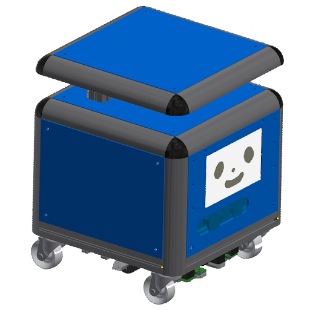

Cube petit(キューブプチ)は人の生活に入り込むことの出来る自律走行ロボットです
世の中に普及させるため低価格で小型なロボットキットを目指して開発しています

ハードウェアは既製品の組み合わせで構成しているのでお好きなセンサーやモーターを取り付けられます。ソフトウェアはオープンソースのROSに対応しており、研究用途でのカスタマイズが可能です

Cube Petit is a desktop-sized Cuboid-kun that is intended to be sold
at low cost and widely distributed around the world.

Cube Petit was born to coexist in people's living spaces,
serve many people, and make many people smile.

Cube Petit is self-driving and can be charged by itself.
There are ivory, clear blue, and yellow color variations.

Cube petitの動画は[Youtube](https://youtube.com/playlist?list=PL509ZQjTHPYecUfyNaroISz6ZV1QCh2k4)でご確認ください
展示会など最新の出店情報は[Twitter @Cube_petit_2022](https://twitter.com/Cube_petit_2022)でご確認ください

---

## Repositories

[cube_petit](https://github.com/sbgisen/cube_petit): This Repository
[cube_petit_cad](https://github.com/sbgisen/cube_petit_cad): Cube petit's CAD
[cube_petit_ros](https://github.com/sbgisen/cube_petit_ros):Ros packages

---

## Contents

1. Hardware Components
2. Specifications
3. Function
4. Event Information
5. DIY Cube petit
6. Development History

## 1. Hardware Components
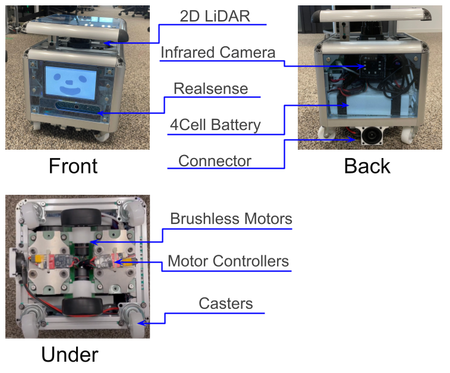

## 2. Specifications
**Version 2**
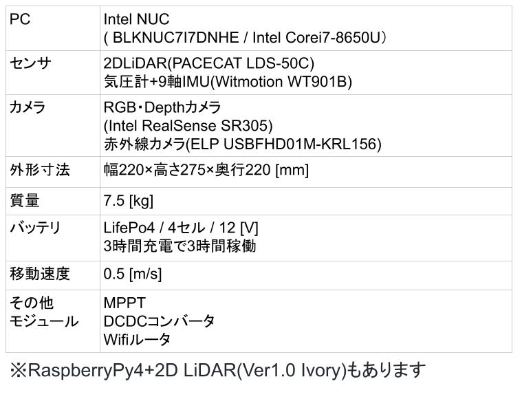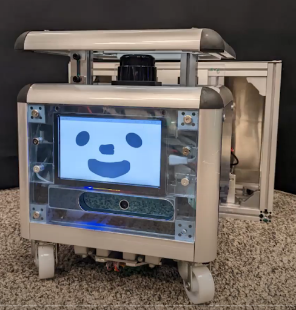

## 3. Function

### 3-1. Basic Function: Mapping and Navigation
**2D LiDAR**で自己位置推定、地図を作成します
さらに**Depth Camera**で人や障害物を避けながら指定した位置まで移動・巡回します
**ROS package**(**gmapping**, **navigation**)を使用しています

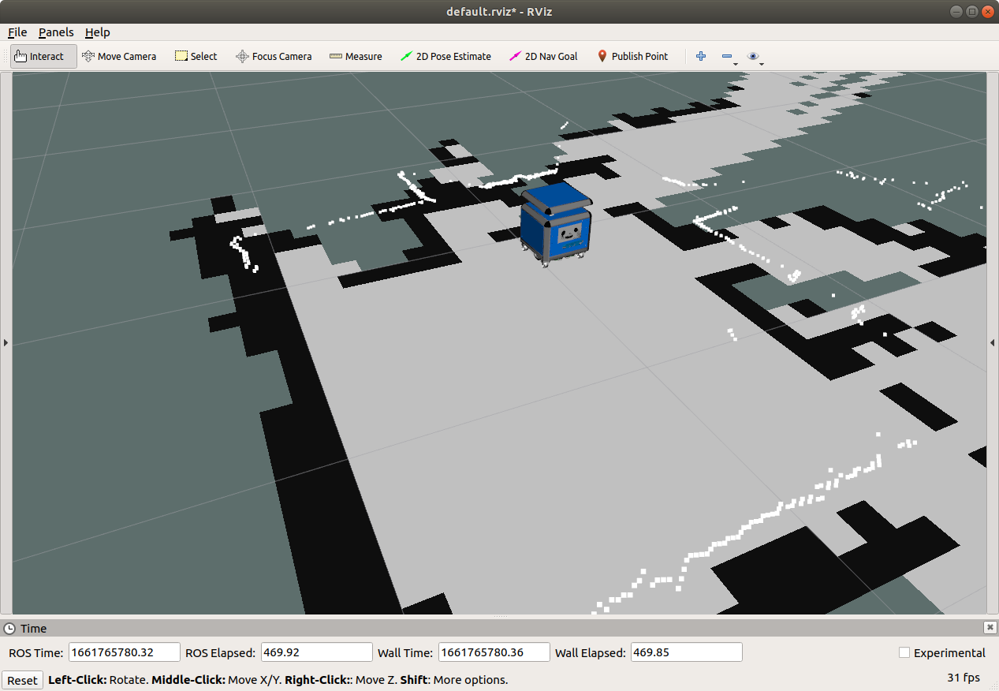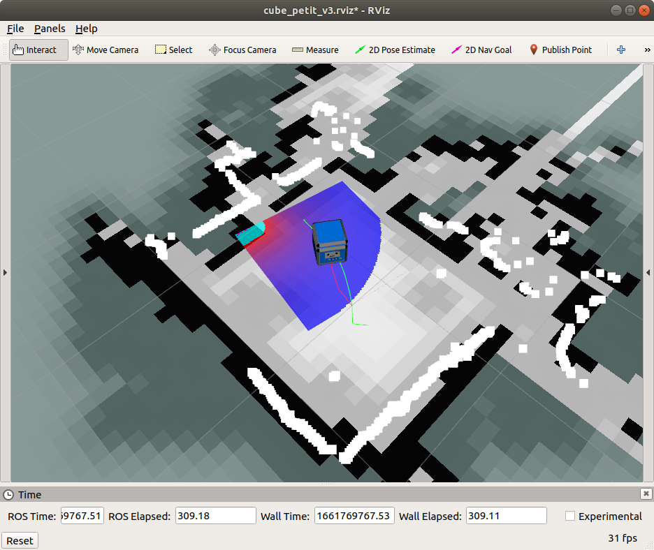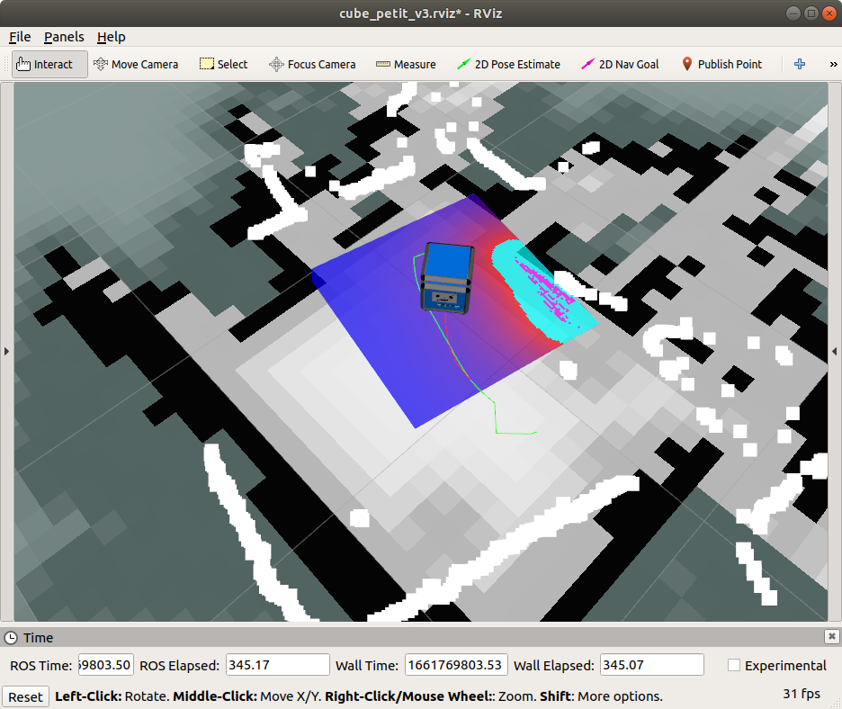

### 3-2. Advanced Function: Auto Charging
**Battery**が減ったことを検知し充電ドックに移動します
ARマーカーを見ながら自動で充電します
**ROS package**(**ar_track_alvar**)を使用しています

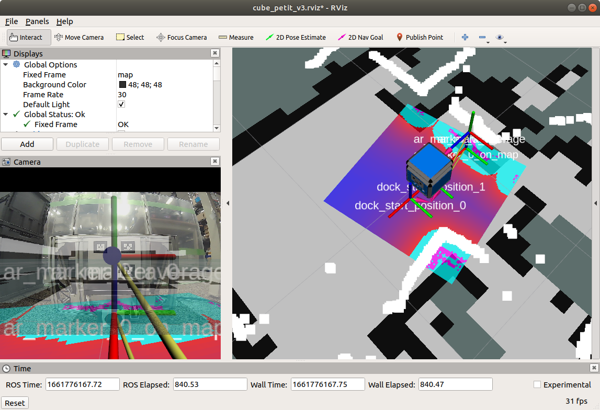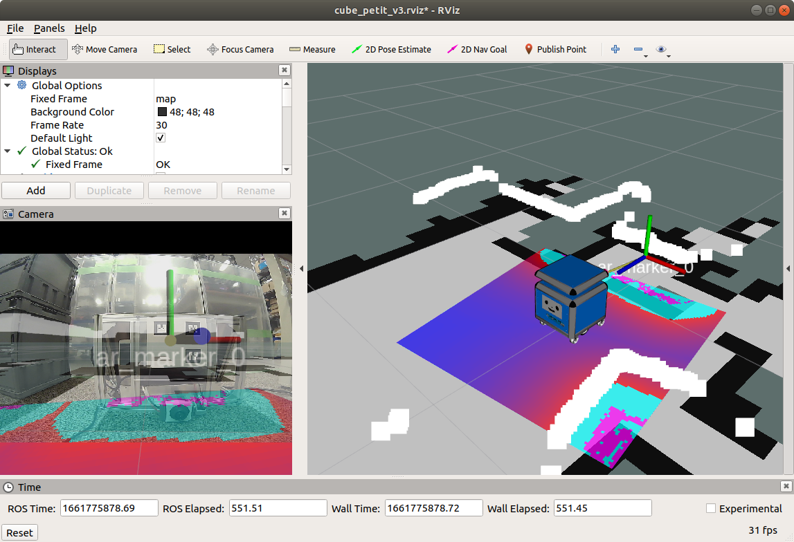
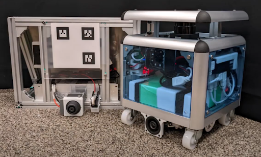

### 3-3. Advanced Function: Offline Conversation

オフラインの日本語のEnglighの音声合成と音声認識に対応しています
日本語の音声合成に**OpenJTalk**、認識に**Julius**を使用しています
感情や速度を変えながら話せます

### 4. Event Information

- 2022/9.3-4 MakerFaireTokyo2022
  - ラジコン操作・会話機能・高さ検知機能のデモ
- 2022/9.7 日本ロボット学会(RSJ2022)
    ラジコン操作・会話機能のデモ
- 2022/8/31~ Youtube動画
- 2022/10/1 HP掲載

### 5. DIY Cube petit

Cube petitの製作方法( Parts list, How to assemble, e.t.c.)
こちらのページ[(リンク先)](./diy_cube_petit/diy_cube_petit.md)で説明します。質問はIssueまたはMail Addressへ

### 6. Development History

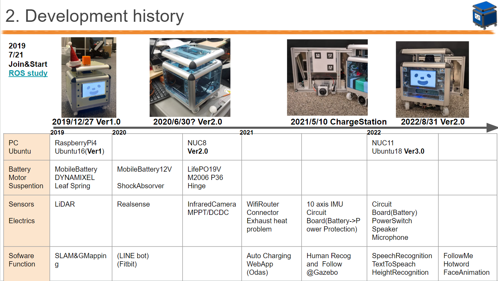

---

## Author

* Airi Yokochi
* Softbank corp.
* airi.yokochi@g.softbank.co.jp

---

## Licence

* MIT
