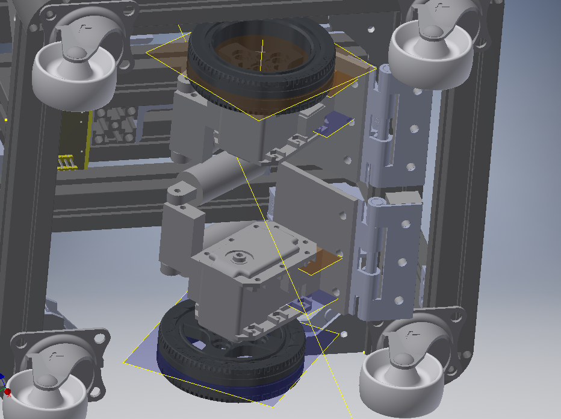
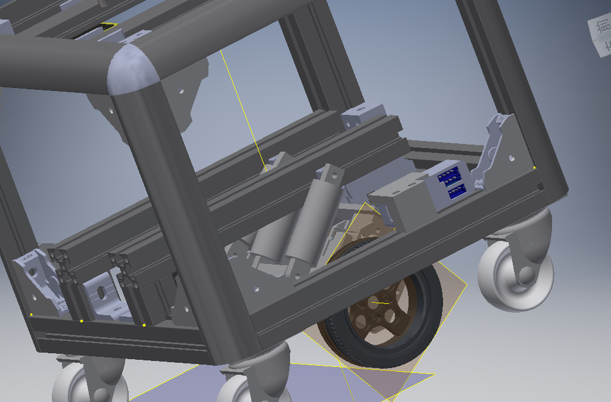
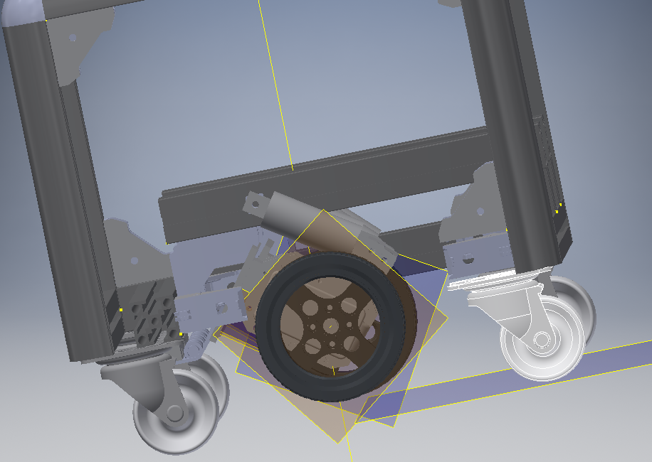
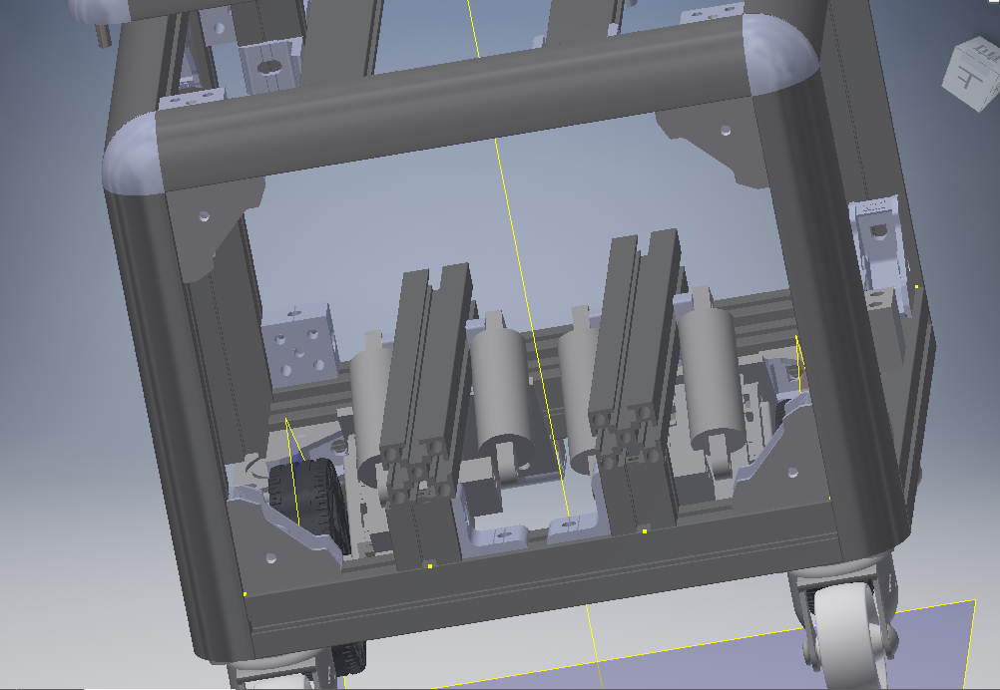

# DIY Cube petit

Cube petitを自作したい人向けの記事です。

## Contents

1. Choose Version
2. Choose Suspension
3. Production Flow
4. Production Documents Link
---

### 1. Choose Version
PCのスペックによってバッテリ・回路が変わります。
難易度的にはモバイルバッテリ(5V~19V)で動かせるものがおすすめ
Jetsonで試すのもあり。現在使っているものは以下

第1世代
・RaspberryPi4(5V/モバイルバッテリ動作)
・センサーは**LiDARのみ**の最小構成
 ・**地図作成・自律移動**が可能
 ・全面にセンサーがないので椅子の脚が見えない
 ・きっと顔も動く
第2世代
・NUC第8世代(19V/Core/消費電力/モバイルバッテリor自作バッテリ動作)：
・センサーに**Realsense(Depthカメラ)**が追加
・地図作成・自律移動・椅子の脚も回避可能
・自作バッテリの場合は背面に充電コネクタ追加、**背面カメラ**が追加で**自動充電**可能
・発話はできる。音声認識には厳しいスペック
第3世代
・NUC第11世代(Core/消費電力/自作バッテリ動作)：
・発話・音声認識が可能
・現在開発中

### 2. Choose Suspension
どっちでもいいです

Cube petit Version1
利点：レーザーカッター＋3Dプリンターなので加工が楽です
欠点：V2より内部に場所を取ります

Cube petit Version2
利点：機体内部には場所を取らないためより多くのセンサーが取付可能です
欠点：NC加工＋3Dプリンターが必要。バネ蝶番の組み立てにコツがいります

### 3. Production Flow
ソフトとハードエレキ一緒にやるのが早いです
カッコ内は自作バッテリの場合の追加工程です

#### Software
1. PCキット調達＆組み立て
1. ROS導入＋パッケージのビルド ---（組み立ての完成）---
1. 各センサ・モータの起動確認
1. Bringup/テレオプ確認
1. Gmapping/Navigationなど各パッケージ確認

#### Hardware/Electric
1. 部品(アルミフレーム・ねじ・ブラケット)調達
1. アルミフレームのボール盤加工・組み立て
1. キャスター取り付け ------------------------------------------
1. ケーブル調達・作成
1. センサー・モータ・ディスプレイ調達
1. 外装・顔周り・Realsense取り付けアクリル板のレーザー加工(発注可？)
1. センサ取り付け部品。足回りの3Dパーツ作成(発注可？)
1. (足回り＆MPPTのNC加工)
1. (バッテリ基板・自動充電基板の発注)※二個目は基板まだ無いです＞＜

#### Assemble
1. 足回りの組み立て
1. 顔ディスプレイ・Realsense・LiDARの取り付け
1. (BMS・MPPTの設定)
1. (背面コネクタ・MPPT・BMSの取り付け)
1. 配線
1. 外装取り付け

#### 4. Production Documents Link

---

#### If you want to Cube petit's Charge Doc
[TODO]
